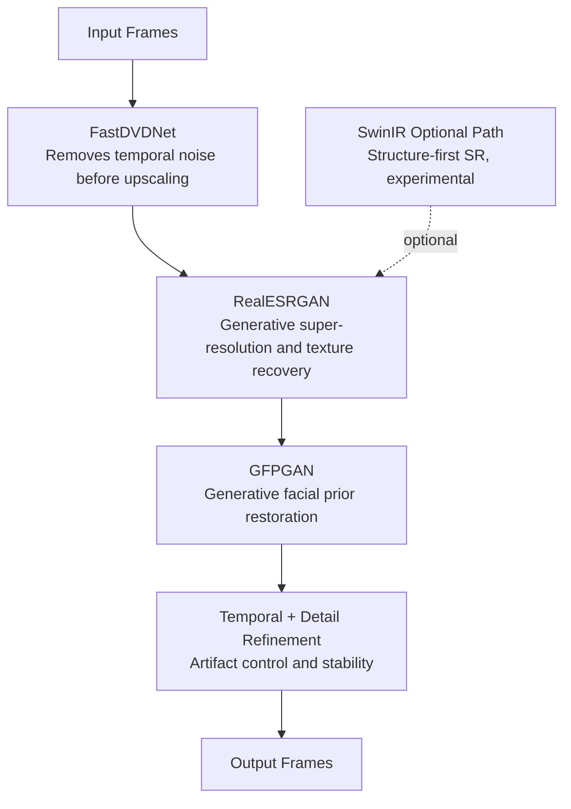

# GAN Video Enhancer

A modular 12-stage video restoration pipeline that combines classical computer vision and deep learning to produce cleaner, sharper, and temporally stable video output.

## What I Built

I designed this project as a full stage-based workflow that takes raw videos through normalization, stabilization, denoising, super-resolution, face restoration, temporal refinement, and final reconstruction.

What I worked on:
- Built the orchestration flow so each stage can run independently or as one full pipeline.
- Combined classical processing and GAN-based enhancement to reduce common artifacts such as flicker, unstable textures, and over-processed faces.
- Structured the repository for practical experimentation and backend integration.
- Added resumable execution so processing can continue from any stage.

How I did it:
- Used FFmpeg-based preprocessing to standardize and stabilize input before AI inference.
- Used FastDVDNet for temporal denoising, RealESRGAN for upscaling, and GFPGAN for face restoration.
- Added post-AI refinement stages for detail control, temporal consistency, and cinematic grading.

## Why This Architecture

Pure GAN pipelines can look strong frame by frame but often fail over time with temporal instability. I use a hybrid flow:

Classical preprocessing -> Deep model enhancement -> Classical post-refinement

This improves consistency and keeps output natural across long clips.

## Architecture Diagrams

### 1) Hybrid GAN System Design (Why this order)


### 2) Model Role Architecture (GAN and non-GAN roles)



### 3) End-to-End 12-Stage Pipeline (Implementation map)


## Quick Start

### 1) Clone

```bash
git clone https://github.com/DeneeshK/GAN_Video_Enhancer.git
cd GAN_Video_Enhancer
```

### 2) Install Dependencies

Prerequisites:
- FFmpeg available in system PATH
- Python 3.10+
- CUDA GPU recommended for stages 07-10

Conda (recommended):

```bash
conda env create -f environment.yml
conda activate esrgan
```

Pip path:

```bash
pip install -r requirements.txt
pip install -r requirements_stage08.txt
```

Note: requirements.txt is currently minimal in this repository. environment.yml is the most complete environment definition.

### 3) Prepare Models

Clone required model repositories:

```bash
mkdir models
cd models
git clone https://github.com/m-tassano/fastdvdnet.git fastdvdnet
git clone https://github.com/xinntao/Real-ESRGAN.git realesrgan
cd ..
```

Download GFPGAN weight:

```bash
python tools/download_models.py
```

Download Stage 08 model weights:

```bash
python tools/download_stage08.py
```

### 4) Add Input Video

Put raw videos in:

```text
input/raw_videos/
```

### 5) Run Full Pipeline

```bash
python scripts/run_pipeline.py
```

### 6) Resume from Any Stage

```bash
python scripts/run_pipeline.py --start-stage 7
```

## Useful Stage Commands

Run only face enhancement:

```bash
python scripts/stage10_gfpgan.py
```

Run Stage 08 with a quality preset:

```bash
python scripts/stage08_superres_simple.py --preset balanced --scale 4
```

Inspect stage 01 options:

```bash
python scripts/stage01_normalize.py --help
```

## Integration Example

```python
from core.pipeline import VideoEnhancementPipeline

pipeline = VideoEnhancementPipeline()
pipeline.run(start_stage=0)
```

## Key Tuning Parameters

- Stage 07 noise map sigma: default 25/255.0
- Stage 08 sharpening: preset-based (soft, balanced, sharp, ultra)
- Stage 10 FACE_STRENGTH: default 0.55
- Stage 12 output FPS: currently fixed in script (default 59)

## Current Limitations

- SwinIR path is optional and experimental, not the default pipeline stage.
- Some parameters are still hardcoded in scripts instead of fully YAML-driven configs.
- Stage 07 includes a hardcoded root path that may require local adjustment.
- Full pipeline is GPU-intensive for high-resolution videos.

## Project Structure

```text
GAN_Video_Enhancer/
|- config.yaml
|- configs/
|- core/
|- models/
|- scripts/
|- tools/
|- utils/
|- environment.yml
|- requirements.txt
|- requirements_stage08.txt
`- README.md
```

## Credits

This project builds on excellent open-source work:
- FastDVDNet: https://github.com/m-tassano/fastdvdnet
- Real-ESRGAN: https://github.com/xinntao/Real-ESRGAN
- GFPGAN: https://github.com/TencentARC/GFPGAN
- FFmpeg: https://ffmpeg.org
- OpenCV: https://opencv.org
- PyTorch: https://pytorch.org

Contributions, bug reports, and optimization ideas are welcome.
